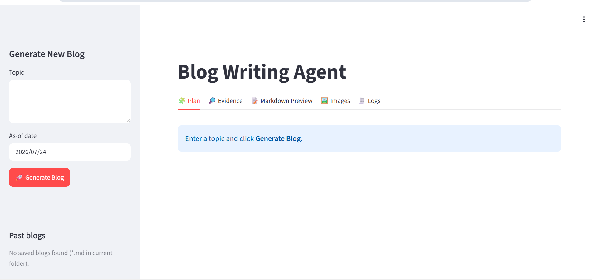
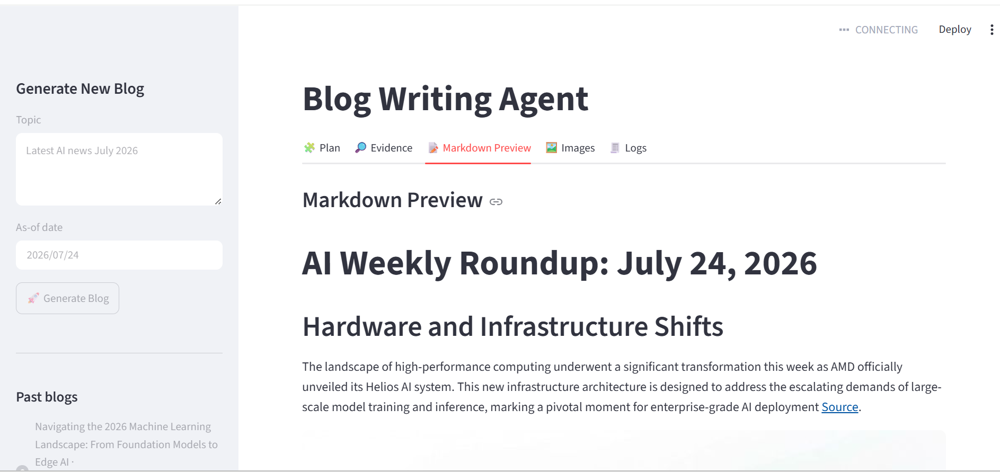
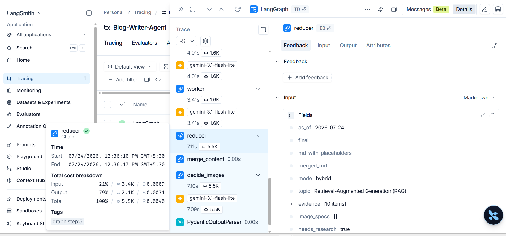

# AI Blog Writing Agent

A Dockerized **multi-agent AI blog generation system** built with **LangGraph**, **Google Gemini**, **Tavily Search**, **Pollinations.ai**, and **Streamlit**.

Given a topic, the system intelligently decides whether web research is required, retrieves relevant evidence, plans a structured article, writes sections in parallel using multiple AI workers, generates supporting images, and produces a publication-ready Markdown blog.

The project demonstrates dynamic routing, parallel agent execution, structured LLM outputs, evidence-grounded content generation, and modular workflow orchestration using LangGraph.

---

# ✨ Features

- Multi-agent workflow powered by LangGraph
- Intelligent routing between closed-book and research-assisted generation
- Live web research using Tavily Search API
- Parallel section generation using LangGraph's `Send()` API
- Evidence-aware blog generation
- AI-powered image generation using Pollinations.ai
- LangSmith tracing for workflow observability
- Dockerized deployment
---

# 🏗️ System Workflow

The figure below shows the actual execution graph generated from the LangGraph workflow.

<p align="center">
  
</p>

While the execution graph visualizes a single **Worker** node, the orchestrator dynamically creates multiple worker executions using LangGraph's `Send()` API. Each worker independently generates one blog section before the reducer combines them into the final article.

## Workflow Overview

The system follows a multi-agent architecture instead of a simple sequential pipeline.

```text
                    User Topic
                         │
                         ▼
                    router node
        decides blog generation strategy
                         │
          ┌──────────────┴──────────────┐
          │                             │
     Research Required?                 No
          │                             │
         Yes                            │
          │                             │
          ▼                             │
     research node                      │
   retrieves web evidence               │
          │                             │
          └──────────────┬──────────────┘
                         ▼
                 orchestrator node
      creates structured blog outline
                         │
               Fan-out using Send()
                         │
      ┌─────────┬─────────┬─────────┬─────────┬─────────┐
      ▼         ▼         ▼         ▼         ▼
   worker     worker    worker    worker    worker
 writes sec1 writes2   writes3   writes4   writes5
      └─────────┴─────────┴─────────┴─────────┴─────────┘
                         │
                         ▼
                  reducer node
        • merge content
        • decide images
        • generate images
                         │
                         ▼
               Final Markdown Blog
```
---

# ⚙️ System Architecture

This project follows a **multi-agent architecture** built using **LangGraph**, where each node is responsible for a specific stage of the blog generation pipeline.

### Router

The workflow begins with the **Router**, which analyzes the user's topic and determines whether the request can be answered using the model's existing knowledge (**closed-book mode**) or requires live web research (**hybrid/open-book mode**).

### Research

When external knowledge is required, the **Research** node retrieves relevant evidence using the **Tavily Search API**. The retrieved sources are structured and passed to downstream nodes to ground the generated content.

### Orchestrator

The **Orchestrator** creates a structured blog plan containing multiple sections. Rather than writing the article sequentially, it prepares independent writing tasks that can be executed concurrently.

### Parallel Workers

The orchestrator uses **LangGraph's `Send()` API** to dynamically fan out one worker for each blog section.

Each worker:

- receives its assigned section,
- follows the generated outline,
- uses retrieved evidence when required,
- produces one Markdown section independently.

This parallel execution reduces overall generation time while keeping each worker focused on a single task.

### Reducer Subgraph

Instead of a single reducer node, the project implements a dedicated **Reducer Subgraph** consisting of three stages:

1. **merge_content** — combines all generated sections into a complete blog.
2. **decide_images** — determines where supporting images should appear.
3. **generate_and_place_images** — generates images using Pollinations.ai and inserts them into the Markdown output.

This separation keeps content generation, image planning, and image generation modular and easier to maintain.

---

# 🛠️ Tech Stack

| Component | Technology |
|------------|------------|
| LLM | Google Gemini |
| AI Framework | LangGraph, LangChain |
| Web Research | Tavily Search API |
| Image Generation | Pollinations.ai |
| Frontend | Streamlit |
| Programming Language | Python 3.11 |
| Observability | LangSmith |
| Deployment | Docker, Render |

---

# 🛠️ Engineering Challenges & Solutions

During development, several real-world engineering challenges were encountered and resolved:

### LLM Provider Compatibility

- Migrated to a supported Gemini model after API changes deprecated the originally used model.
- Implemented a response normalization helper to handle provider-specific output formats, since Gemini can return structured content while other providers return plain strings.

### Research Pipeline Reliability

- Fixed a recency-filter issue where valid search results could be discarded when publication dates were unavailable or not parseable.
- Added a fallback mechanism to preserve relevant evidence instead of returning an empty result set.

### Robust External API Calls

- Added retry logic with exponential backoff for external API requests using **Tenacity**, improving reliability against transient failures.

### Modular Reducer Design

- Implemented the reducer as a dedicated LangGraph subgraph (`merge_content → decide_images → generate_and_place_images`) to separate content merging, image planning, and image generation into independent stages.

# 📸 Screenshots

## 🏠 Application Interface

The Streamlit interface allows users to enter a topic, select an as-of date, and generate AI-powered blogs through an interactive multi-agent workflow.

<p align="center">
  
</p>

---

## 📝 Generated Blog Preview

A generated Markdown blog produced by the LangGraph workflow, enriched with research evidence, structured sections, and AI-generated images.

<p align="center">
  
</p>

---

## 🔍 LangSmith Execution Trace

LangSmith tracing visualizes the execution of each LangGraph node, enabling debugging, monitoring, and inspection of routing decisions, worker execution, and reducer operations.

<p align="center">
  
</p>

---

# 🚀 Future Improvements

- Implement asynchronous execution to reduce end-to-end blog generation latency.
- Introduce human-in-the-loop editing and approval before publishing generated blogs.